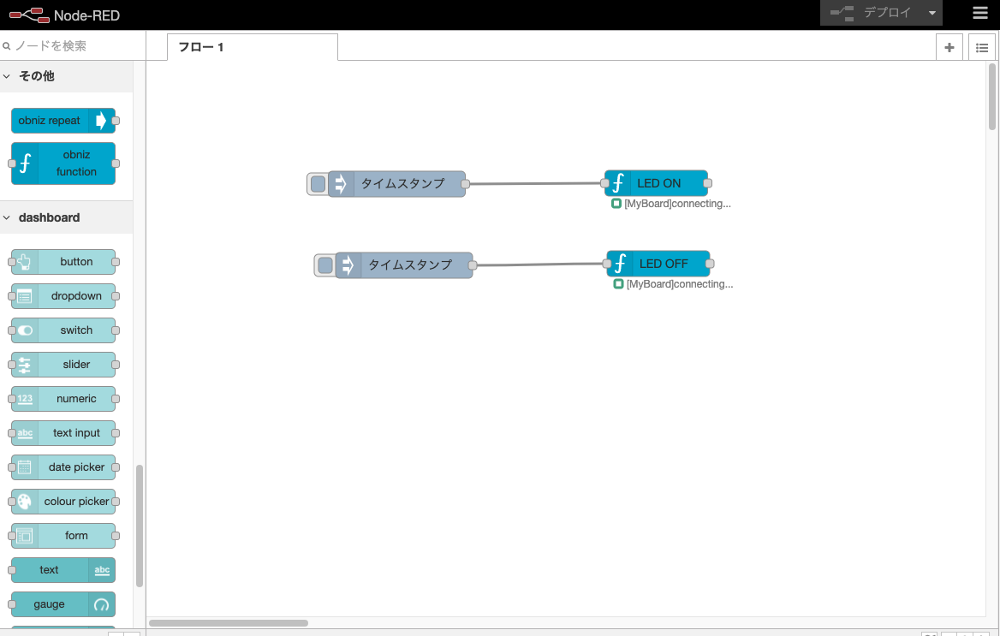

# node-red-obniz-sample

Node-RED上のobnizノードを使用するサンプルです。

## 事前準備

obnizBoard もしくは obnizBoard 1Yをセットアップし、wifiにつなげて5V対応のLEDを接続します

## フローの実行方法

1.「LED ON」ノード内の設定よりobnizIDを指定してください

2. デプロイを行い、nodeの下の `connecting...` が `connected` に変わるのを確認下さい

3. Injectノードを押すとLEDが点灯／消灯します
